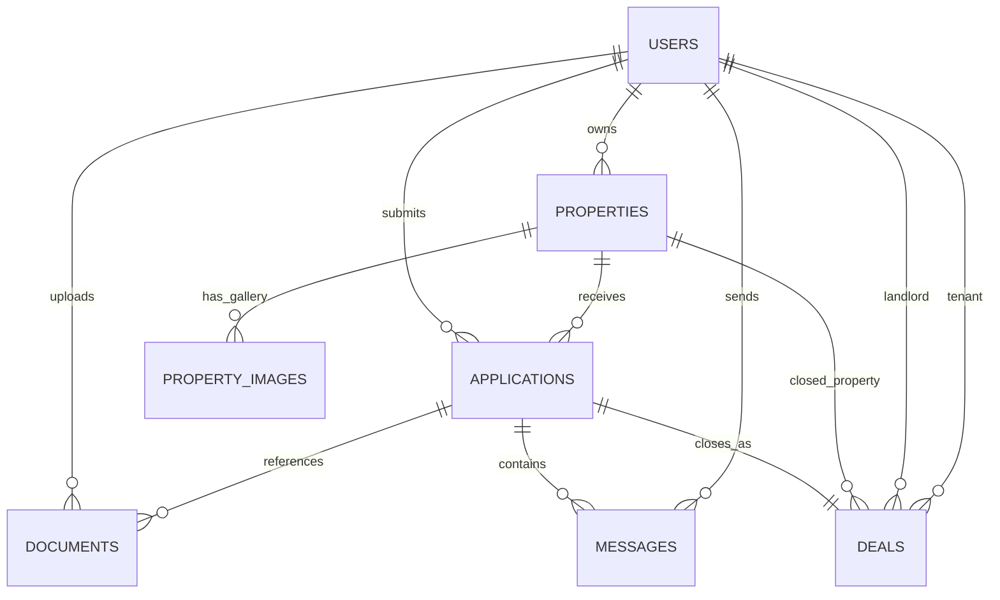

# Modelo de datos (F1-T05 / F2-T01)

Este modelo prepara las entidades base del MVP y sirve como contrato inicial para las siguientes epicas.

## Entidades

- `users`: perfil interno vinculado a usuario autenticado (`auth_user_id`) y rol.
- `properties`: inmuebles publicados por propietarios con datos completos de publicacion.
- `applications`: postulaciones de inquilinos a inmuebles.
- `documents`: archivos/documentos asociados al inquilino o a una solicitud.
- `property_images`: imagenes de inmuebles con orden de visualizacion para galeria.
- `messages`: mensajes entre partes dentro del contexto de una solicitud.
- `deals`: cierre de operacion asociado a una solicitud aceptada.

## Diagrama ER (simple)



## Campos clave de `properties` (F2-T01)

- `title`, `description`, `city`, `neighborhood`, `address`
- `monthly_price`, `deposit_amount`, `currency`
- `bedrooms`, `bathrooms`, `area_m2`, `is_furnished`
- `available_from`, `contract_type`, `status`

Reglas relevantes:
- `monthly_price > 0`
- `deposit_amount >= 0`
- `bedrooms >= 0`
- `bathrooms >= 0`
- `area_m2 > 0`
- `contract_type in ('long_term', 'temporary', 'monthly')`
- `status in ('pendiente', 'publicado', 'rechazado')`

Indices para busqueda:
- `idx_properties_city` (`city`)
- `idx_properties_monthly_price` (`monthly_price`)
- `idx_properties_city_monthly_price` (`city`, `monthly_price`)

## Migraciones versionadas

- `database/migrations/0001_initial_schema.up.sql`
- `database/migrations/0001_initial_schema.down.sql`
- `database/migrations/0002_properties_full_entity.up.sql`
- `database/migrations/0002_properties_full_entity.down.sql`
- `database/migrations/0003_property_images.up.sql`
- `database/migrations/0003_property_images.down.sql`

Comandos:

```bash
dotnet run -- migrate up
dotnet run -- migrate down
```

Requisito: `DATABASE_URL` apuntando a PostgreSQL.
