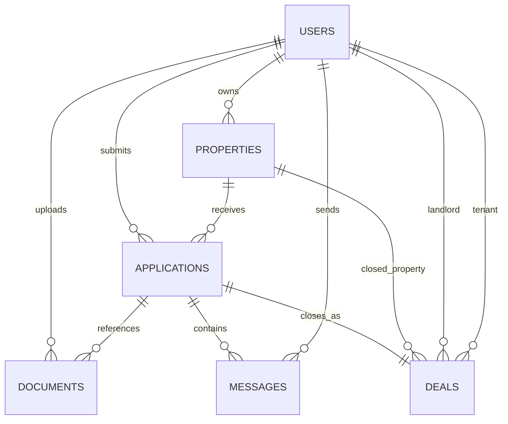

# Modelo de datos inicial (F1-T05)

Este modelo prepara las entidades base del MVP y sirve como contrato inicial para las siguientes epicas.

## Entidades

- `users`: perfil interno vinculado a usuario autenticado (`auth_user_id`) y rol.
- `properties`: inmuebles publicados por propietarios.
- `applications`: postulaciones de inquilinos a inmuebles.
- `documents`: archivos/documentos asociados al inquilino o a una solicitud.
- `messages`: mensajes entre partes dentro del contexto de una solicitud.
- `deals`: cierre de operacion asociado a una solicitud aceptada.

## Diagrama ER (simple)



## Migraciones versionadas

- `database/migrations/0001_initial_schema.up.sql`
- `database/migrations/0001_initial_schema.down.sql`

Comandos:

```bash
dotnet run -- migrate up
dotnet run -- migrate down
```

Requisito: `DATABASE_URL` apuntando a PostgreSQL.
